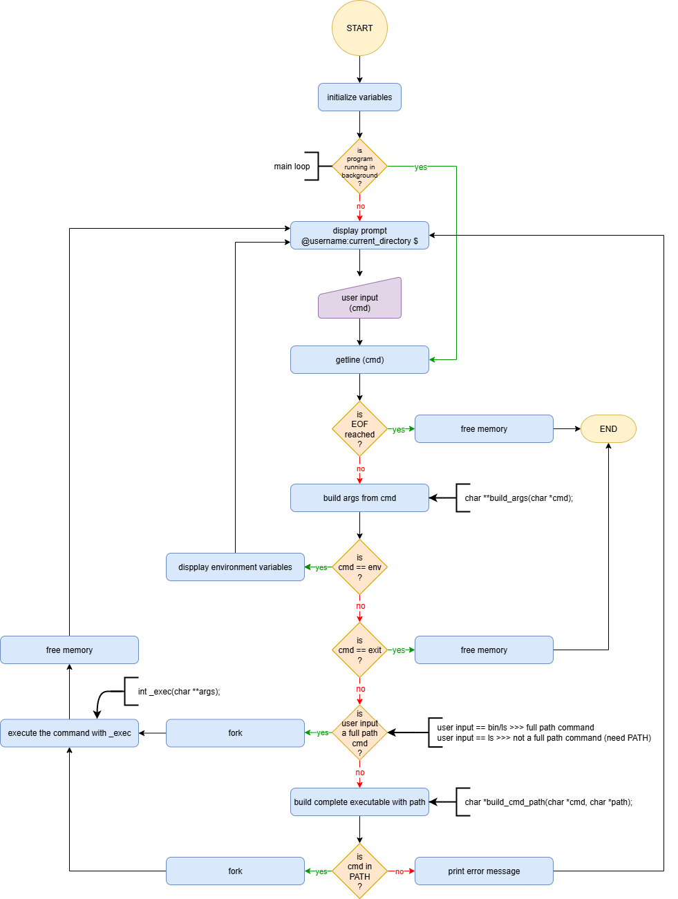

# Simple Shell

## Table of contents

<details>
    <summary>
        CLICK TO ENLARGE 😇
    </summary>
    <a href="#description">Description</a>
    <br>
    <a href="#objectives">Objectives</a>
    <br>
    <a href="#requirements">Requirements</a>
    <br>
    <a href="#instructions">Instructions</a>
    <br>
    <a href="#tech-stack">Tech stack</a>
    <br>
    <a href="#files-description">Files description</a>
    <br>
    <a href="#installation_and_how_to_use">Installation and how to use</a>
    <br>
    <a href="#thanks">Thanks</a>
    <br>
    <a href="#authors">Authors</a>
</details>

## <span id="description">Description</span>

The Simple Shell is a basic UNIX command interpreter.  
It provides a prompt where users can type commands, execute programs, and interact with the system.  
The shell supports both standard and special commands for environment management and file operations.

To successfully complete this project, we designed the flowchart shown below.

<table>
    <tr valign="top">
        <td align="center">
            <picture>
                <source media="(prefers-color-scheme: dark)" srcset="./assets/images/simple_shell_flowchart-dark.webp">
                <source media="(prefers-color-scheme: light)" srcset="./assets/images/simple_shell_flowchart-light.webp">
                
            </picture>
        </td>
    </tr>
</table>

## <span id="objectives">Objectives</span>

At the end of this project, I should be able to explain to anyone, **without the help of Google**:

- Who designed and implemented the original Unix operating system?
- Who wrote the first version of the UNIX shell?
- Who invented the B programming language (the direct predecessor to the C programming language)?
- Who is Ken Thompson?
- How does a shell work?
- What is a `pid` and a `ppid`?
- How to manipulate the environment of the current process?
- What is the difference between a function and a system call?
- How to create processes?
- What are the three prototypes of `main`?
- How does the shell use the `PATH` to find the programs?
- How to execute another program with the `execve` system call?
- How to suspend the execution of a process until one of its children terminates?
- What is `EOF` (end-of-file)?

## <span id="requirements">Requirements</span>

- My programs and functions will be compiled with `gcc` using the flags `-Wall`, `-Werror`, `-Wextra`, `-pedantic` and `-std=gnu89`.
- All my files should end with a new line.
- My code should use the Betty style. It will be checked using [betty-style.pl](https://github.com/hs-hq/Betty/blob/main/betty-style.pl) and [betty-doc.pl](https://github.com/hs-hq/Betty/blob/main/betty-doc.pl).
- The shell should not have any memory leaks.
- No more than 5 functions per file.
- All my header files should be include guarded.

<details>
    <summary>
        List of allowed functions and system calls.
    </summary>

- `all` functions from string.h
- `access` (man 2 access)
- `chdir` (man 2 chdir)
- `close` (man 2 close)
- `closedir` (man 3 closedir)
- `execve` (man 2 execve)
- `exit` (man 3 exit)
- `_exit` (man 2 _exit)
- `fflush` (man 3 fflush)
- `fork` (man 2 fork)
- `free` (man 3 free)
- `getcwd` (man 3 getcwd)
- `getline` (man 3 getline)
- `getpid` (man 2 getpid)
- `isatty` (man 3 isatty)
- `kill` (man 2 kill)
- `malloc` (man 3 malloc)
- `open` (man 2 open)
- `opendir` (man 3 opendir)
- `perror` (man 3 perror)
- `printf` (man 3 printf)
- `fprintf` (man 3 fprintf)
- `vfprintf` (man 3 vfprintf)
- `sprintf` (man 3 sprintf)
- `putchar` (man 3 putchar)
- `read` (man 2 read)
- `readdir` (man 3 readdir)
- `signal` (man 2 signal)
- `stat` (__xstat) (man 2 stat)
- `lstat` (__lxstat) (man 2 lstat)
- `fstat` (__fxstat) (man 2 fstat)
- `strtok` (man 3 strtok)
- `wait` (man 2 wait)
- `waitpid` (man 2 waitpid)
- `wait3` (man 2 wait3)
- `wait4` (man 2 wait4)
- `write` (man 2 write)

</details>

## <span id="instructions">Instructions</span>

### Mandatory

<details>
    <summary>
        <b>0. README, man, AUTHORS</b>
    </summary>
    <br>

- Write a `README`.
- Write a `man` for your shell.
- You should have an `AUTHORS` file at the root of your repository, listing all individuals having contributed content to the repository. Format, see [Docker](https://github.com/moby/moby/blob/master/AUTHORS).

#
**Repo:**
- GitHub repository: `holbertonschool-simple_shell`.
- File: `README.md`, `man_1_simple_shell`, `AUTHORS`.
<hr>
</details>

<details>
    <summary>
        <b>1. Betty would be proud</b>
    </summary>
    <br>

Write a beautiful code that passes the Betty checks.

#
**Repo:**
- GitHub repository: `holbertonschool-simple_shell`.
<hr>
</details>

<details>
    <summary>
        <b>2. Simple shell 0.1</b>
    </summary>
    <br>

Write a UNIX command line interpreter.

- Usage: `simple_shell`.

Your Shell should:

- Display a prompt and wait for the user to type a command. A command line always ends with a new line.
- The prompt is displayed again each time a command has been executed.
- The command lines are simple, no semicolons, no pipes, no redirections or any other advanced features.
- The command lines are made only of one word. No arguments will be passed to programs.
- If an executable cannot be found, print an error message and display the prompt again.
- Handle errors.
- You have to handle the “end of file” condition (`Ctrl+D`)

You don’t have to:

- Use the PATH.
- Implement built-ins.
- Handle special characters: `"`, `'`, `` ` ``, `\`, `*`, `&`, `#`.
- Be able to move the cursor.
- Handle commands with arguments.

`execve` will be the core part of your Shell, don’t forget to pass the environ to it…

```bash
julien@ubuntu:~/shell$ ./shell 
#cisfun$ ls
./shell: No such file or directory
#cisfun$ /bin/ls
barbie_j       env-main.c  exec.c  fork.c  pid.c  ppid.c    prompt   prompt.c  shell.c  stat.c         wait
env-environ.c  exec    fork    mypid   ppid   printenv  promptc  shell     stat test_scripting.sh  wait.c
#cisfun$ ^[[D^[[D^[[D
./shell: No such file or directory
#cisfun$ ^[[C^[[C^[[C^[[C
./shell: No such file or directory
#cisfun$ exit
./shell: No such file or directory
#cisfun$ ^C
julien@ubuntu:~/shell$ echo "/bin/ls" | ./shell
barbie_j       env-main.c  exec.c  fork.c  pid.c  ppid.c    prompt   prompt.c  shell.c  stat.c         wait
env-environ.c  exec    fork    mypid   ppid   printenv  promptc  shell     stat test_scripting.sh  wait.c
julien@ubuntu:~/shell$
```

#
**Repo:**
- GitHub repository: `holbertonschool-simple_shell`.
<hr>
</details>

<details>
    <summary>
        <b>3. Simple shell 0.2</b>
    </summary>
    <br>

Simple shell 0.1 +

- Handle command lines with arguments.

#
**Repo:**
- GitHub repository: `holbertonschool-simple_shell`.
<hr>
</details>

<details>
    <summary>
        <b>4. Simple shell 0.3</b>
    </summary>
    <br>

Simple shell 0.2 +

- Handle the `PATH`.
- `fork` must not be called if the command doesn’t exist.

```bash
julien@ubuntu:~/shell$ ./shell_0.3
:) /bin/ls
barbie_j       env-main.c  exec.c  fork.c  pid.c  ppid.c    prompt   prompt.c  shell_0.3  stat    test_scripting.sh  wait.c
env-environ.c  exec    fork    mypid   ppid   printenv  promptc  shell     shell.c    stat.c  wait
:) ls
barbie_j       env-main.c  exec.c  fork.c  pid.c  ppid.c    prompt   prompt.c  shell_0.3  stat    test_scripting.sh  wait.c
env-environ.c  exec    fork    mypid   ppid   printenv  promptc  shell     shell.c    stat.c  wait
:) ls -l /tmp 
total 20
-rw------- 1 julien julien    0 Dec  5 12:09 config-err-aAMZrR
drwx------ 3 root   root   4096 Dec  5 12:09 systemd-private-062a0eca7f2a44349733e78cb4abdff4-colord.service-V7DUzr
drwx------ 3 root   root   4096 Dec  5 12:09 systemd-private-062a0eca7f2a44349733e78cb4abdff4-rtkit-daemon.service-ANGvoV
drwx------ 3 root   root   4096 Dec  5 12:07 systemd-private-062a0eca7f2a44349733e78cb4abdff4-systemd-timesyncd.service-CdXUtH
-rw-rw-r-- 1 julien julien    0 Dec  5 12:09 unity_support_test.0
:) ^C
julien@ubuntu:~/shell$ 
```

#
**Repo:**
- GitHub repository: `holbertonschool-simple_shell`.
<hr>
</details>

<details>
    <summary>
        <b>5. Simple shell 0.4</b>
    </summary>
    <br>

Simple shell 0.3 +

- Implement the `exit` built-in, that exits the shell.
- Usage: `exit`.
- You don’t have to handle any argument to the built-in `exit`.

#
**Repo:**
- GitHub repository: `holbertonschool-simple_shell`.
<hr>
</details>

<details>
    <summary>
        <b>6. Simple shell 1.0</b>
    </summary>
    <br>

Simple shell 0.4 +

- Implement the `env` built-in, that prints the current environment.

```bash
julien@ubuntu:~/shell$ ./simple_shell
$ env
USER=julien
LANGUAGE=en_US
SESSION=ubuntu
COMPIZ_CONFIG_PROFILE=ubuntu
SHLVL=1
HOME=/home/julien
C_IS=Fun_:)
DESKTOP_SESSION=ubuntu
LOGNAME=julien
TERM=xterm-256color
PATH=/home/julien/bin:/home/julien/.local/bin:/usr/local/sbin:/usr/local/bin:/usr/sbin:/usr/bin:/sbin:/bin:/usr/games:/usr/local/games:/snap/bin
DISPLAY=:0
$ exit
julien@ubuntu:~/shell$ 
```

#
**Repo:**
- GitHub repository: `holbertonschool-simple_shell`.
<hr>
</details>

### Advanced

<details>
    <summary>
        <b>12. Simple shell 0.4.2</b>
    </summary>
    <br>

Simple shell 0.4 +

- Handle `Ctrl+C`: your shell should not quit when the user inputs `^C`.

#
**Repo:**
- GitHub repository: `holbertonschool-simple_shell`.
<hr>
</details>

<details>
    <summary>
        <b>14. cd</b>
    </summary>
    <br>

Simple shell 1.0 +

Implement the builtin command `cd`:

- Changes the current directory of the process.
- Command syntax: `cd [DIRECTORY]`.
- If no argument is given to `cd` the command must be interpreted like `cd $HOME`.
- You have to handle the command `cd -`.
- You have to update the environment variable `PWD` when you change directory.

#
**Repo:**
- GitHub repository: `holbertonschool-simple_shell`.
<hr>
</details>

## <span id="tech-stack">Tech stack</span>

<p align="left">
    
    
    
    
</p>

## <span id="files-description">Files description</span>

| **FILES**            | **DESCRIPTION**                                                      |
| :------------------: | -------------------------------------------------------------------- |
| `assets`             | Contains the resources required for the repository.                  |
| `main.h`             | Includes libraries and function prototypes.                          |
| `main.c`             | Contains the main function of the shell (entry point).              |
| `exec.c`             | Contains functions to execute a command with arguments.              |
| `args.c`             | Contains the argument and path management functions.                 |
| `env.c`              | Contains environment management functions.                           |
| `commands.c`         | Contains functions to handle special commands like `env`, `exit`... |
| `taieb.c`            | Contains a secret function for our SWE at Holberton School.          |
| `man_1_simple_shell` | `man` page of the Simple Shell.                                      |
| `AUTHORS`            | List of all contributors to the content of the repository.           |
| `README.md`          | The README file you are currently reading 😉.                       |

## <span id="installation_and_how_to_use">Installation and how to use</span>

**Installation:**

1. Clone this repository:
    - Open your preferred Terminal.
    - Navigate to the directory where you want to clone the repository.
    - Run the following command:

```bash
git clone https://github.com/fchavonet/holbertonschool-simple_shell.git
```

2. Open the repository you've just cloned.

3. Compile the source code:

```bash
gcc -Wall -Werror -Wextra -pedantic -std=gnu89 *.c -o hsh
```

**How to use:**

1. Run the program:

```bash
./hsh
```

2. To use Simple Shell, type a command and press Enter.

- Examples of commands that you can run:
    - `ls`: list the contents of the current directory.
    - `pwd`: print the path of the current working directory.
    - `exit`: exit the simple shell.

- You can also run commands that require arguments, such as:
    - `ls -l`: list the contents of the current directory in long format.
    - `mkdir 42`: create a new directory called "42".
    - `echo "Hello, Hugo!"`: display the message "Hello, Hugo!" on the screen.

3. Open the MAN page:

```bash
./man_1_simple_shell
```

> If the file does not open, you may need to grant execution permissions first.

## <span id="thanks">Thanks</span>

- A big thank you to all my Holberton School peers for their help and support throughout this project.

## <span id="authors">Authors</span>

**Fabien CHAVONET**
- GitHub: [@fchavonet](https://github.com/fchavonet)

**Pierre-Émmanuel SAINT-MÉZARD**
- Github: [@Eonvorax](https://github.com/Eonvorax)
